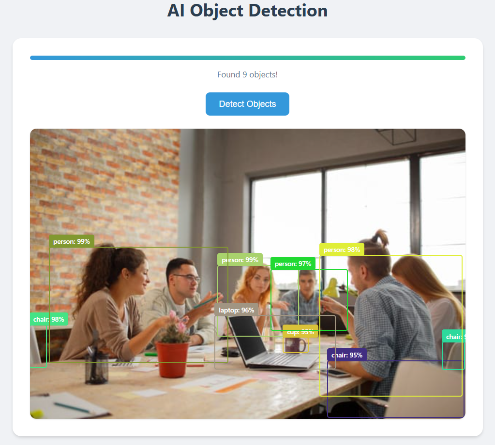

# AI Object Detection with YOLO & Transformers.js

A modern web-based object detection application that uses state-of-the-art AI models to detect and label objects in images. This tool leverages the YOLO (You Only Look Once) tiny model through Transformers.js, providing real-time object detection directly in the browser without requiring a backend server.

## 🌐 Live Demo

Try out the application here: [Live Demo](https://cswiz2003.github.io/object-detection-hf-xenova-yolos-tiny)

## 🌟 Showcase

### Input Image


### Detection Results


## 🌟 Features

- **Fast & Efficient:**
  - Lightweight YOLO-tiny model (~20MB)
  - Real-time browser-based processing
  - No backend server required
  - Works offline after initial model download

- **Modern User Interface:**
  - Clean, minimalist design
  - Real-time progress tracking
  - Smooth animations and transitions
  - Responsive layout
  - Interactive detection boxes
  - Color-coded object labels

- **Smart Processing:**
  - High confidence threshold (95%)
  - Automatic model caching
  - Multiple object detection
  - Percentage-based coordinates
  - Clear visual feedback

- **Progress Tracking:**
  - Visual progress bar
  - Detailed status messages
  - Download progress indication
  - Processing state updates
  - Results summary

## 🛠️ Technologies Used

- HTML5 & CSS3
- JavaScript (ES6+)
- Transformers.js
- YOLO-tiny Model
- Hugging Face Model Hub

## 🚀 Setup

1. Clone the repository:
```bash
git clone https://github.com/cswiz2003/object-detection-hf-xenova-yolos-tiny.git
cd object-detection-hf-xenova-yolos-tiny
```

2. Install dependencies:
```bash
npm install
```

3. Start the development server:
```bash
npm start
```

4. Open your browser and navigate to:
```
http://localhost:8080
```

## 💻 Usage

1. Open the web application in your browser
2. Wait for the AI model to load (~20MB download first time)
3. Click the "Detect Objects" button
4. View the detected objects with:
   - Bounding boxes
   - Object labels
   - Confidence scores

## 🔧 Technical Requirements

- Modern web browser (Chrome, Firefox, Edge)
- JavaScript enabled
- Minimum 4GB RAM recommended
- Internet connection for initial model download
- ~20MB free space for model caching

## 🎨 UI Features

- Gradient progress bar
- Smooth animations
- Responsive design
- Interactive elements
- Clear status messages
- Modern card layout
- Hover effects
- Shadow effects

## 🤝 Contributing

Contributions are welcome! Please feel free to submit a Pull Request. For major changes, please open an issue first to discuss what you would like to change.

## 📝 License

This project is licensed under the MIT License - see the [LICENSE](LICENSE) file for details.

## 🙏 Acknowledgments

- [Hugging Face](https://huggingface.co/) for providing the AI models and hosting
- [Transformers.js](https://github.com/xenova/transformers.js) for browser-based AI capabilities
- [YOLO](https://pjreddie.com/darknet/yolo/) for the original object detection algorithm

## 📧 Contact
Feel free to reach out:
- LinkedIn: https://www.linkedin.com/in/shafique7z/
- GitHub: https://github.com/cswiz2003

---

<p align="center">Made with ❤️ by Shafique</p> 
